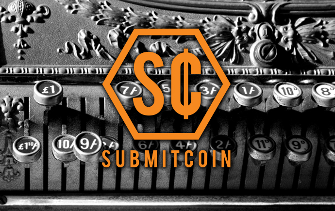
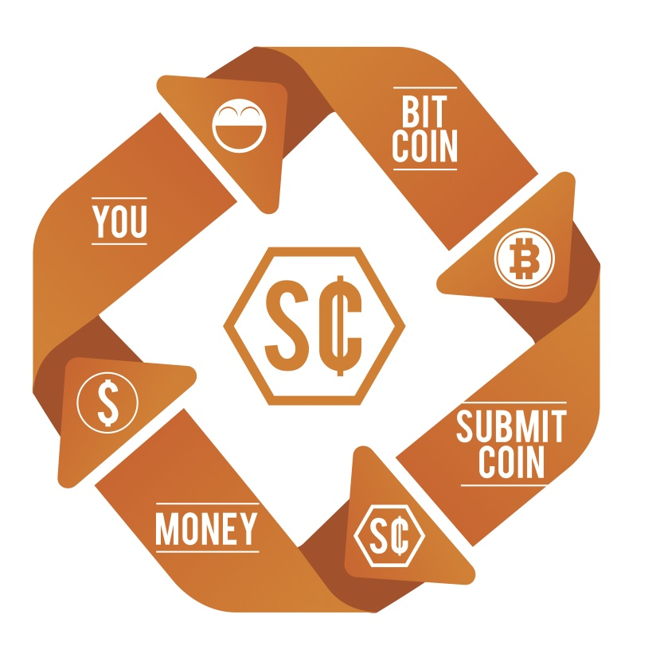

  

SubmitCoin was started to enable the crypto currency community to gain the ability to spend Bitcoin easily.  Debuting at the StartUp Weekend Missoula Montana event SubmitCoin has moved forward to expand the offering and now has offices and representatives in Missoula, MT and New York City, NY.

## What is SubmitCoin?
SubmitCoin simply acts as a mechanism to convert crypto-currencies into merchant friendly funds so that you can spend them anywhere regardless if they accept Bitcoin or not.

## How does SubmitCoin work?
That's a pretty complicated question as it is changing all of the time. See the info-graphic below for a simplified version for you.

## When will it be released?
We are releasing in phases.  Our proof of concept phase is complete and the current phase (virtual cards) is in the alpha stages of testing.  Speed of release is determined by a number of factors including availability of programming, completion of testing at each phase (usability, security and efficiency) and funding.

## Why can't I just get started now?
There is still a bit of work to do to make it all ready for prime time.  However if you would like to start getting setup to use Bitcoin, [CoinBase](https://coinbase.com/?r=531b83cd2c8a747a6b00027f&utm_campaign=user-referral&src=referral-link) is a good place.

  

